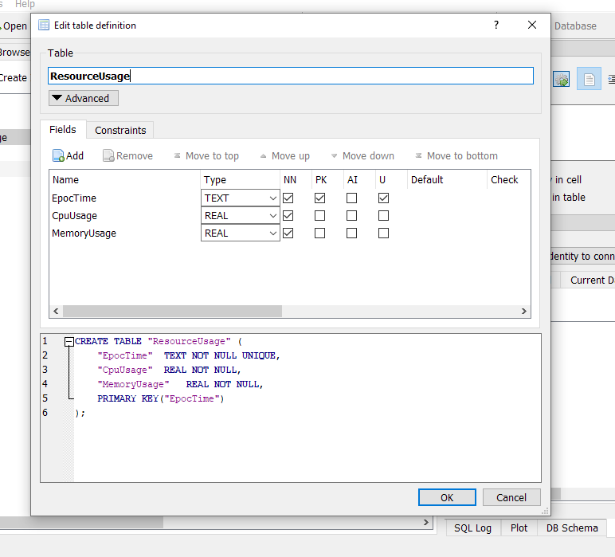

# RemoteMonitor

Monitoritoring distributed systems is a very important process that is necessary to ensure that the system is performing optimally. This web api helps in doing just that. Deploy this web app to every server instance and start collecting performance data of our server from your local machine.

Performance parameters - 
- Cpu usage in %.
- Memory usage in MB.
- Combined Cpu and Memory usage.

Analyze these parameters to appropriately scale up/down your systems.

---

## Getting Started

### Prerequisites
- Clone this repo to your local machine.
- Install C# and .NET if you havent already.
- Install [sqlite db viewer](https://sqlitebrowser.org/dl/).

### Initial Setup
- Create a database named ResourceDb and structure it as follows - \
      


### How to use
```Powershell
    BaseUrl - https://localhost:5001/

    IntermediateRoutes- 
        - cpu/
        - memory/
        - totalresources/

    LeafRoutes -
        - current
        - daily
        - peakusages
        - lowestusages
        - longestpeakusage
        - longestlowestusage

    Examples - 
        - https://localhost:5001/cpu/current
        - https://localhost:5001/memory/daily
        - https://localhost:5001/totalresources/lowestusages

```

### Happy Monitoring 😊.

---

# Authors
* RapiDash1